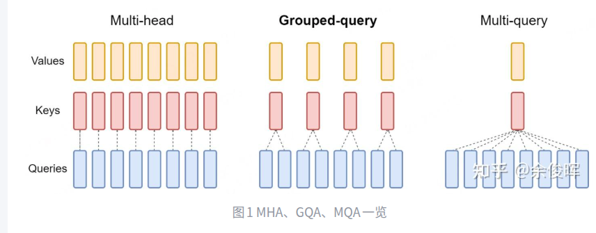
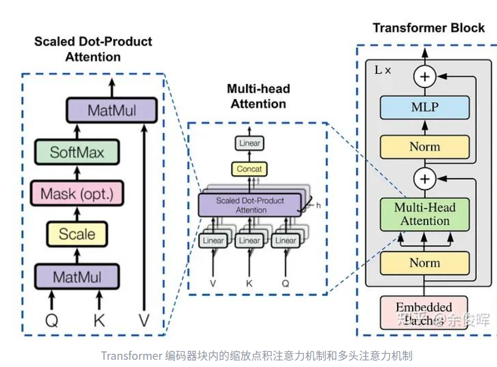
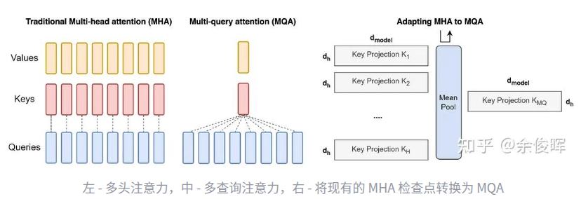

MHA（muti-Head Attention多头注意力机制）
独立的query,key,Value
https://zhuanlan.zhihu.com/p/1890128241

「MHA 就是把 hidden 维拆成多个子空间，每个子空间各自做 softmax 注意力，再把结果拼接并线性投影；目的是让模型并行地从不同角度聚合上下文信息。」

Attention(Q, K, V) = softmax(Q·K^T/√d_k)·V
如果不进行缩放，当d_k较大时，点积的结果可能会变得非常大，这会导致在应用softmax函数时产生的梯度非常小

# MHA

1. 把 (Q,K,V) 线性投影成多组 ((Q_i, K_i, V_i))，每一组做一遍 Scaled Dot-Product Attention，得到一份「上下文表示」。
2. 单头 attention 的公式不变
3. 多头再拼起来，再线性融合

batch_size = hidden_states.size(0)
size(0) = 第 0 维长度
如果 hidden_states 形状是常见的 [B, T, C]（batch, seq_len, hidden_dim），那它取到的就是 B
在 MHA 里后面通常会用 batch_size 去做 view/reshape，比如把 [B, T, C] 拆成 [B, num_heads, T, head_dim]。

hidden_dim（也常写 d_model）就是每个 token 的特征向量长度，也叫“隐藏层维度”
* batch：一次多少条样本
* seq_len：每条样本多少个 token
* hidden_dim：每个 token 用多少维数字表示

x = hidden.view(batch_size, -1, self.num_heads, self.head_dim).transpose(1,2)
把输入从 [B, T, hidden_dim] 变成多头注意力常用的 [B, H, T, D]。
* 把最后一维 hidden_dim 拆成 num_heads * head_dim

embed_dim 就是 embedding 向量的维度，通常也等同于 Transformer 里的 hidden_dim / d_model

MQA是MHA的一种变体，也是用于自回归解码的一种注意力机制。
MQA 让所有的Head之间共享同样的一份 K 和 V 矩阵（意味K和V的计算唯一），只让 Q 保留了原始多头的性质（每个Head存在不同的转换），从而大大减少 K 和 V 矩阵的参数量以及KV Cache的显存占用，以此来达到提升推理速度，但是会带来精度上的损失

# GQA(分组注意力机制)
分成G组，每一组分配有一个键（K）和值（V）头
* GQA-1 = MQA：只有一个组（G = 1），GQA 等同于 MQA，因为所有查询头只有一个键和值头。
* GQA-H = MHA：当组数等于头数（G = H）时，GQA 退化为 MHA，每个查询头都有其唯一的键和值头。
GQA可以平衡MHA和MQA。由于键值相对较少，内存带宽和数据加载需求被最小化。G的选择是一种权衡，更多的组就会接近MHA带来更高的质量但是性能较慢，而更少的组性能快但是牺牲质量

MHA：K/V 头数 = num_heads（每头独立）
MQA：K/V 头数 = 1（全头共享）
GQA：K/V 头数 = group_num（介于两者之间）