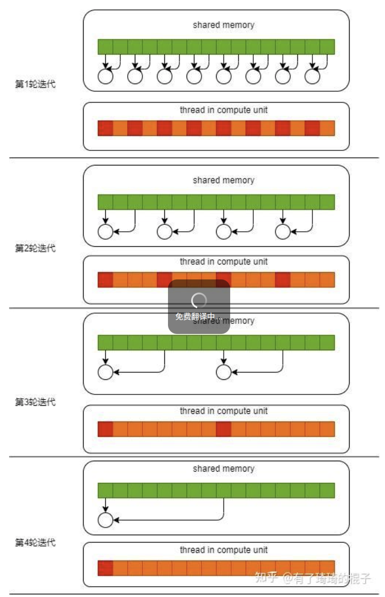

 Warp：GPU执行的真正单元

**Warp的定义**：

- 一个Warp包含**32个连续的Thread**
- 这32个Thread**同时执行相同的指令**
- Warp是SM调度的基本单元

### **SIMT vs SIMD**

Single Instruction, Multiple Thread

Single Instruction, Multiple Data

### **2. Warp调度与执行**

每个SM有多个Warp调度器（Scheduler）：

|           |     |      |
| --------- | --- | ---- |
| Volta     | 4   | 4条指令 |
| Ampere    | 4   | 4条指令 |
| Hopper    | 4   | 4条指令 |
| Blackwell | 4   | 4条指令 |

`lane` 可以理解成：**一个 warp 里的“线程座位号”**。

在 NVIDIA CUDA 里通常：

- 1 个 warp = **32 个线程**
- 每个线程在 warp 内有编号 **0~31**
- 这个编号就叫 **lane id**
- **精度与稳定性**
  - FP32 规约：数值更稳，误差更小
  - FP16 规约：更省带宽/寄存器，但累加误差明显更大，RMSNorm/LayerNorm 这类 reduce 一般不建议全程 half 累加
- `__shfl_xor_sync(..., float, ...)` 是最常规路径
- `__shfl_xor_sync(..., half, ...)` 在不同 CUDA/架构上的可用性与表现更敏感；工程里更常见是 **先** `__half2float` **转 float 再规约**

性能取舍

- FP16 理论吞吐高，但规约阶段通常不是纯算力瓶颈，且精度风险更大
- 实务常用“**half 存储 + float 规约**”折中方案

这段 rms_norm_f16x8_pack_f16_kernel 的优化点可以分成 “已有优化” 和 “还能继续优化” 两部分：
已有优化点（你现在已经做到了）
x8 pack 向量化并行：idx 按 *8 前进，每线程处理 8 个 half，线程粒度更粗，减少调度/索引开销。
128-bit 访存：LDST128BITS(...) 一次搬 8 个 FP16（pack_x/pack_y），比标量 load/store 访存指令更少。
#pragma unroll：8 次循环展开，减少 loop 控制分支，提高 ILP。
block 内归约：block_reduce_sum_f16_f16 做块级方差和，s_variance 放 shared，避免每线程重复算 rsqrt。
快路径写回：idx+7 < N*K 时走一次 128-bit store，主路径吞吐高。
当前主要瓶颈 / 可改进点（最值得优化）
精度路径不理想（最关键）
你现在 variance、s_variance 都是 half，RMSNorm 的 reduce 通常应 FP32 累加 + FP32 rsqrt，最后再转 half。
这既提升数值稳定性，也常提升收敛/一致性。

边界处理不完整
只在写回判断 idx+7 < N*K，但 LDST128BITS(x[idx]) 是无条件读；尾块可能越界读。
需加 tail path（K 非 8 倍数、末尾不满 8）。

按 N*K 线性边界不够“按行”
RMSNorm 是按行（每个 bid 的 K）归一化。你的边界判断用全局 N*K，理论上可能跨行读写。
更稳妥是基于 row_base = bid*K 的行内边界判断。

shared 标量可能形成精度瓶颈
s_variance 用 half，建议换 float s_inv_rms，最后乘法再 cast half。

g 设计为标量
LLM 常见 RMSNorm 是每通道 gamma（长度 K 向量）。标量 g 虽快但语义简化了。可做两版：标量快路径 + 向量 gamma[k] 通用路径。

进阶优化（你后续可冲）
用 half2 + __hfma2 累加局部平方和（再转 float reduce）。
减少 local 数组压力：观察寄存器/本地内存溢出（Nsight Compute 看 local load/store）。
选择更匹配的 block 大小（如 128/256）并做 occupancy tuning。
融合后处理（若后面有 bias/残差）减少一次全局读写。
一句话总结：
你这版的核心优化是 x8 + 128bit 向量访存；下一步最大收益点是 把方差路径改成 FP32、补齐 tail/行边界，这样会同时提升正确性和真实性能。