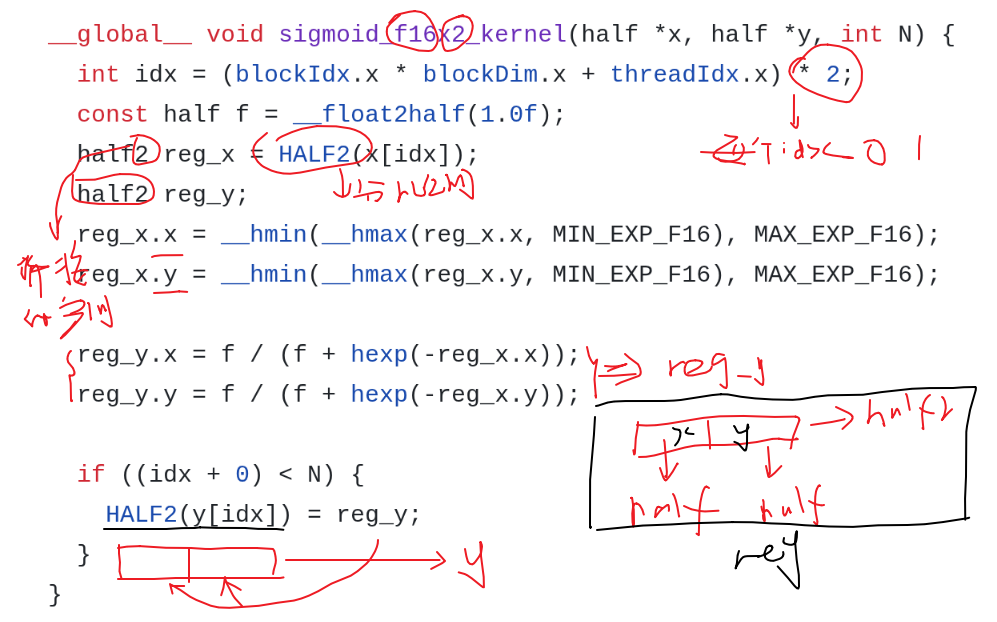

y[idx] = 1.0 / (1.0 + exp(-x[idx]))

# pack和unpack哪个比较好
结论先说：没有绝对谁更好，要看数据长度、对齐、尾部比例和你算子是算力瓶颈还是带宽瓶颈。
* pack（向量化打包，128-bit 读写）：

    大多数大张量、对齐好、N 足够大时更快
    优势来自更少的 load/store 指令、更高带宽利用率
    但实现复杂，尾部处理麻烦，对齐不对会掉速或出错

* unpack（标量逐元素）：

  代码简单、通用性强、边界安全
  小规模数据或尾部占比高时不一定比 pack 慢多少
  但在大规模内存带宽场景通常跑不过 pack

面试可这么答：

“我会用 pack 做主路径，unpack 做尾部回退。当 idx+vector_width-1 < N 且地址对齐时走 pack，否则走 unpack。这样同时保证吞吐和正确性。”

-------------------------------------------------------------------------------------
                                        S=1024, K=1024
           out_f32: [0.28003782, 0.37907076], time:0.04406857ms
         out_f32x4: [0.28003782, 0.37907076], time:0.01947927ms
        out_f32_th: [0.28003782, 0.37907076], time:0.02322984ms
-------------------------------------------------------------------------------------
           out_f16: [0.2800293, 0.37915039], time:0.06290698ms
         out_f16x2: [0.2800293, 0.37915039], time:0.02615404ms
         out_f16x8: [0.2800293, 0.37915039], time:0.02020764ms
     out_f16x8pack: [0.2800293, 0.37915039], time:0.02182436ms
        out_f16_th: [0.2800293, 0.37915039], time:0.01793885ms
-------------------------------------------------------------------------------------
-------------------------------------------------------------------------------------
                                        S=1024, K=2048
           out_f32: [0.85732645, 0.33384302], time:0.05805588ms
         out_f32x4: [0.85732645, 0.33384302], time:0.04281878ms
        out_f32_th: [0.85732639, 0.33384302], time:0.04220557ms
-------------------------------------------------------------------------------------
           out_f16: [0.85742188, 0.33374023], time:0.06688499ms
         out_f16x2: [0.85742188, 0.33374023], time:0.07334161ms
         out_f16x8: [0.85742188, 0.33374023], time:0.04216671ms
     out_f16x8pack: [0.85742188, 0.33374023], time:0.03494263ms
        out_f16_th: [0.85742188, 0.33374023], time:0.03311992ms
-------------------------------------------------------------------------------------
-------------------------------------------------------------------------------------
                                        S=1024, K=4096
           out_f32: [0.37293798, 0.7181108], time:0.10960269ms
         out_f32x4: [0.37293798, 0.7181108], time:0.09023905ms
        out_f32_th: [0.37293798, 0.7181108], time:0.07946229ms
-------------------------------------------------------------------------------------
           out_f16: [0.37280273, 0.71826172], time:0.12355208ms
         out_f16x2: [0.37280273, 0.71826172], time:0.07864690ms
         out_f16x8: [0.37280273, 0.71826172], time:0.08784437ms
     out_f16x8pack: [0.37280273, 0.71826172], time:0.06723928ms
        out_f16_th: [0.37304688, 0.71826172], time:0.06069899ms
-------------------------------------------------------------------------------------
-------------------------------------------------------------------------------------
                                        S=2048, K=1024
           out_f32: [0.65779519, 0.57216692], time:0.10428286ms
         out_f32x4: [0.65779519, 0.57216692], time:0.04414535ms
        out_f32_th: [0.65779519, 0.57216692], time:0.04585576ms
-------------------------------------------------------------------------------------
           out_f16: [0.65771484, 0.57226562], time:0.12882304ms
         out_f16x2: [0.65771484, 0.57226562], time:0.05099106ms
         out_f16x8: [0.65771484, 0.57226562], time:0.04301596ms
     out_f16x8pack: [0.65771484, 0.57226562], time:0.04005909ms
        out_f16_th: [0.65771484, 0.57226562], time:0.03117228ms
-------------------------------------------------------------------------------------
-------------------------------------------------------------------------------------
                                        S=2048, K=2048
           out_f32: [0.53974897, 0.37389249], time:0.10733414ms
         out_f32x4: [0.53974897, 0.37389249], time:0.07800508ms
        out_f32_th: [0.53974897, 0.37389246], time:0.08083582ms
-------------------------------------------------------------------------------------
           out_f16: [0.54003906, 0.3737793], time:0.13052678ms
         out_f16x2: [0.54003906, 0.3737793], time:0.13912106ms
         out_f16x8: [0.54003906, 0.3737793], time:0.07921147ms
     out_f16x8pack: [0.54003906, 0.3737793], time:0.07966113ms
        out_f16_th: [0.53955078, 0.3737793], time:0.06579661ms
-------------------------------------------------------------------------------------
-------------------------------------------------------------------------------------
                                        S=2048, K=4096
           out_f32: [0.49684548, 0.63384551], time:0.39750719ms
         out_f32x4: [0.49684548, 0.63384551], time:0.39232874ms
        out_f32_th: [0.49684548, 0.63384545], time:0.41982722ms
-------------------------------------------------------------------------------------
           out_f16: [0.49707031, 0.63378906], time:0.24200654ms
         out_f16x2: [0.49707031, 0.63378906], time:0.15354705ms
         out_f16x8: [0.49707031, 0.63378906], time:0.16694617ms
     out_f16x8pack: [0.49707031, 0.63378906], time:0.12579703ms
        out_f16_th: [0.49682617, 0.63378906], time:0.10731578ms
-------------------------------------------------------------------------------------
-------------------------------------------------------------------------------------
                                        S=4096, K=1024
           out_f32: [0.46120992, 0.85734457], time:0.17400098ms
         out_f32x4: [0.46120992, 0.85734457], time:0.08256054ms
        out_f32_th: [0.46120992, 0.85734457], time:0.07730484ms
-------------------------------------------------------------------------------------
           out_f16: [0.46118164, 0.85742188], time:0.21942019ms
         out_f16x2: [0.46118164, 0.85742188], time:0.08885860ms
         out_f16x8: [0.46118164, 0.85742188], time:0.06991196ms
     out_f16x8pack: [0.46118164, 0.85742188], time:0.06967616ms
        out_f16_th: [0.46118164, 0.85742188], time:0.05884719ms
-------------------------------------------------------------------------------------
-------------------------------------------------------------------------------------
                                        S=4096, K=2048
           out_f32: [0.64455467, 0.50403714], time:0.34588790ms
         out_f32x4: [0.64455467, 0.50403714], time:0.35826707ms
        out_f32_th: [0.64455462, 0.5040372], time:0.35733724ms
-------------------------------------------------------------------------------------
           out_f16: [0.64501953, 0.50390625], time:0.24617028ms
         out_f16x2: [0.64501953, 0.50390625], time:0.27095795ms
         out_f16x8: [0.64501953, 0.50390625], time:0.13522387ms
     out_f16x8pack: [0.64501953, 0.50390625], time:0.12561870ms
        out_f16_th: [0.64453125, 0.50390625], time:0.10902619ms
-------------------------------------------------------------------------------------
-------------------------------------------------------------------------------------
                                        S=4096, K=4096
           out_f32: [0.22352408, 0.62061536], time:0.66944599ms
         out_f32x4: [0.22352408, 0.62061536], time:0.71150208ms
        out_f32_th: [0.22352406, 0.62061536], time:0.71444774ms
-------------------------------------------------------------------------------------
           out_f16: [0.22363281, 0.62060547], time:0.57961822ms
         out_f16x2: [0.22363281, 0.62060547], time:0.36701322ms
         out_f16x8: [0.22363281, 0.62060547], time:0.34109044ms
     out_f16x8pack: [0.22363281, 0.62060547], time:0.35931253ms
        out_f16_th: [0.22351074, 0.62060547], time:0.35554171ms
-------------------------------------------------------------------------------------

1) 正确性先看
各版本输出值基本一致（f32* 彼此一致，f16* 与 f16_th 在半精度误差范围内），说明实现总体正确。
没再出现之前 f16x2 = 0 的异常，说明你修复有效。
2) FP32 路径结论（f32 / f32x4 / f32_th）
f32x4 在小中规模有优势（如 1024x1024, 2048x1024 明显快于标量 f32）。
到大规模（如 4096x2048, 4096x4096）时，f32x4 和 f32_th 接近甚至略慢。
说明：FP32 sigmoid 在大张量下更像带宽受限，手写向量化收益被框架内核优化吃掉了。
3) FP16 路径结论（重点）
标量 f16 一直最慢或接近最慢（预期，单元素访存/指令开销高）。
f16x8、f16x8pack 普遍显著快于标量 f16，向量化收益明显。
但与 f16_th 对比：
小规模时互有胜负
中大规模时 f16_th 往往仍更快（例如 2048x4096, 4096x1024, 4096x2048）
说明：你的自定义 kernel 已经接近框架水平，但在调度/访存细节上还没全面超过 PyTorch 内建实现。
4) x8 vs x8pack
x8pack 在不少 case 优于 x8（如 1024x2048, 2048x4096, 4096x2048），说明 128-bit 打包访存有效。
但不是全场景都赢（4096x4096 反而略慢），说明 pack 路径也受对齐、尾部、寄存器压力影响。
5) 可以写进总结/面试的话
核心结论：向量化（x4/x8/pack）显著优于标量实现；但在大规模下算子接近带宽上限，手写 CUDA 与框架内核差距缩小。
工程含义：自定义 kernel 的价值在“特定数据形状 + 融合场景”更明显；单独 sigmoid 这种轻算子，框架库本身已很强。
下一步优化方向：减少边界分支、检查对齐与 pack 尾处理、考虑 fuse（如 bias+sigmoid）而非单算子优化。
如果你要，我可以按这组数据给你整理一版“可直接贴到 sigmoid.md 的实验结论模板（含小表格）”。