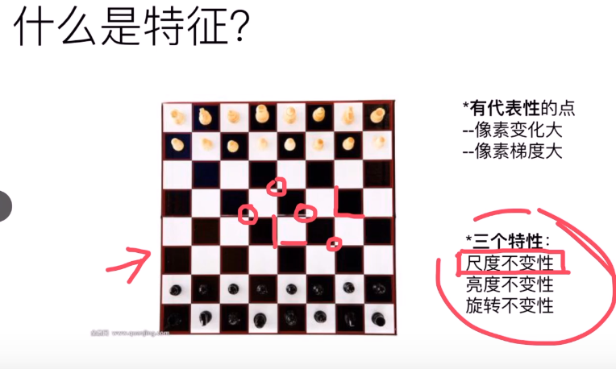

# BA（Bundle Adjustment）是光束法平差
BA就是同时调整多个传感器位姿和场景几何特征
可以一句话说：“多相机、多路标点一起做一次大规模非线性最小二乘。”

优化的目标函数是什么：

ORB 主要是：
拆解流程
* 金字塔构建
* FAST角点检测
* NMS(非极大值抑制)+角点筛选
* 方向计算
* BRIEF 描述子生成
CUDA 优化核心：每一步都变成数据并行 kernel，减少 CPU 串行参与。

2) FAST 检测：像素级并行
每个线程处理一个像素（或 tile 内一个像素）
先做阈值快速排除（减少完整圆环判断）
圆环 16 点测试在共享内存邻域里读，减少全局访存
收益：FAST 是热点，通常是第一大加速来源。

3) NMS + TopK：并行筛选
在 block 内做局部 NMS（比较邻域响应）
用原子计数或并行前缀和收集候选点
分层（按网格）保留角点，避免都挤在纹理区域
收益：保证特征分布均匀，同时保持吞吐。

4) 方向与描述子：按点并行
一个线程/warp 处理一个 keypoint 的方向统计
BRIEF 采样对通过常量内存存 pattern（固定采样点对）
尽量用向量化读（如 uchar4）和共享内存 patch 缓存
收益：减少随机访存，提升描述子阶段效率。

5）内存与执行层优化（cuda关键）
* 共享内存：缓存图像 tile，减少重复 global load
* 寄存器复用：热点中间量不落内存
*coalesced access：线程束按连续地址读写
* 多 stream 流水：H2D -> kernel -> D2H 重叠执行
* 减少 launch 开销：小算子融合，降低 kernel 数

“CUDA 优化 ORB 本质是把 FAST/NMS/方向/BRIEF 全链路并行化，并通过共享内存缓存邻域、warp 级并行和 stream 流水重叠拷贝与计算；在保证特征质量不退化的前提下显著降低单帧时延。”

“ORB 邻域访问重复度高，我用 shared tile 把 global 读合并成 block 级预取，后面线程主要打 shared。角点输出用分块缓冲 + 少量原子做 compact，避免全局长排序；因为角点数量远小于像素线程数，争用不激烈，所以原子不是瓶颈，整体仍比 CPU 串行快很多。”

定位：ofast算法
描述：rBRIEF描述方法

---
---
nvcc -O3 orb_fast_cuda_demo.cu -o orb_fast_cuda_demo
./orb_fast_cuda_demo

算子本身 GPU 很快（>10x），端到端被内存与调度开销拖慢。改成复用显存缓冲版本

你要的“复用显存缓冲降低端到端开销”已经生效，尤其多流路径改善很明显。
我做的修改
在 zhuoyu/ba_jacobian_compare.cu 里：

run_cuda_single_stream

改成静态缓存 d_obs/d_out + capacity
只有当 N 变大才重新分配
移除了每次调用的 cudaFree
run_cuda_multi_stream

改成静态缓存 streams、device chunk buffers、pinned host buffers
当 n_stream/chunk 变化时才重建
当 N 超过容量时才重新申请 pinned 内存
移除了每次调用末尾的销毁逻辑
最新实测结果
CPU baseline(avg) : 26.0116 ms
CUDA 1 stream(avg): 36.623 ms（比之前 44.59ms 有改善）
CUDA 4 streams(avg): 51.6482 ms（比之前 173ms 明显改善）
CUDA kernel-only(avg): 2.0225 ms（约 12.86x）
Check err (1k sum): 0.0146046（数值一致性保持）
当前端到端仍未超过 CPU，主要因为这个 demo 的单观测算术强度偏低、copy 比例仍高；但 kernel-only 已稳定在 ~13x，能很好支撑“CUDA 计算端显著加速”的论述。